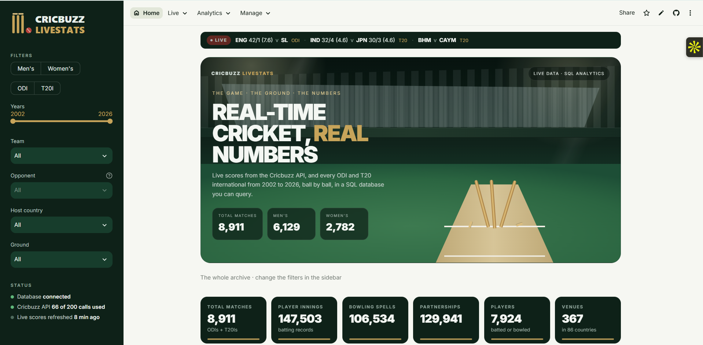
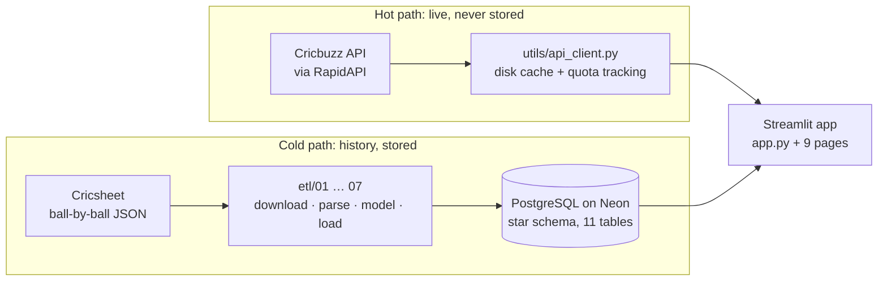
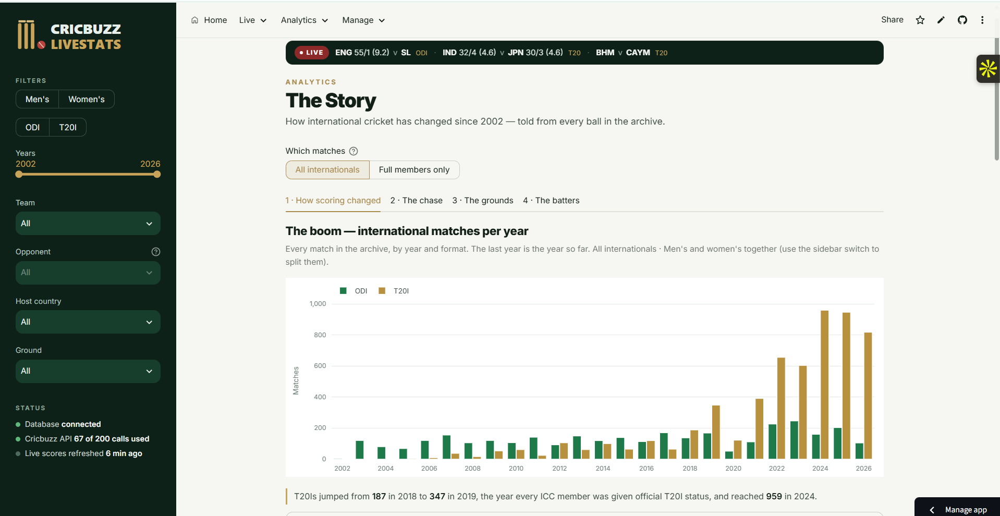
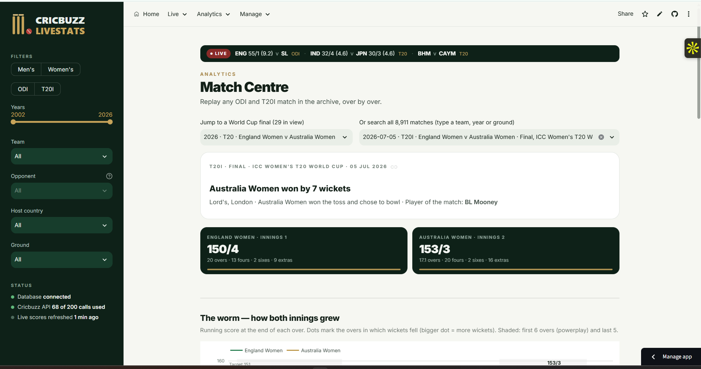
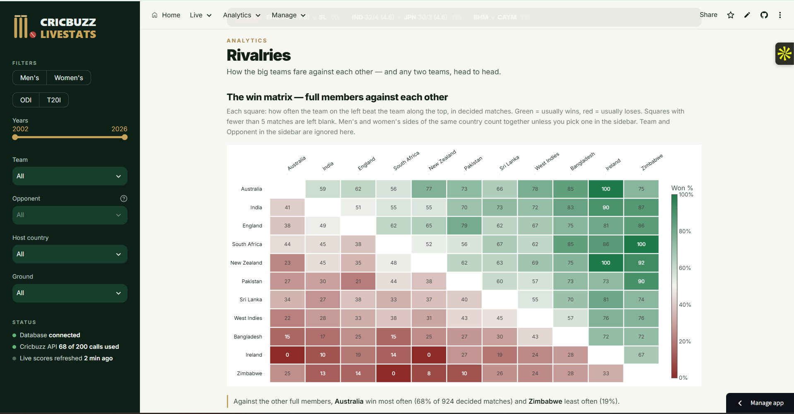
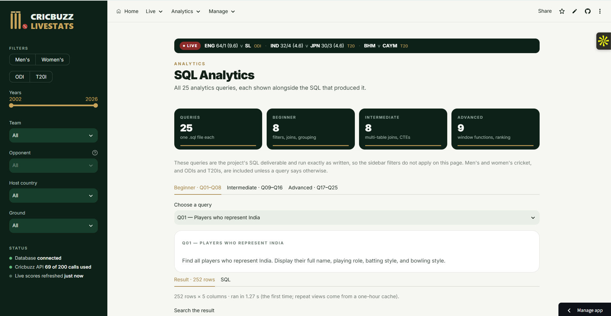

# 🏏 Cricbuzz LiveStats

**Real-time cricket insights and SQL-based analytics.** Live scores from the Cricbuzz API, plus every men's and women's ODI and T20 international since 2002, ball by ball, in a PostgreSQL warehouse. All of it is presented in a nine-page Streamlit dashboard.

**Live app:** https://cricbuzz-livestats-tanay.streamlit.app

Built by **Tanay Nagpal** as the Labmentrix capstone project.



---

## What it does

| Page | What you can do there |
|---|---|
| **Home** | Archive at a glance: 8,911 matches, run leaders, and tiles that follow every filter |
| **Live Matches** | Matches in progress, just finished and coming up (men's, women's, domestic, leagues), with full scorecards on demand |
| **Top Stats** | Cricbuzz's all-time leaderboards (ODI, T20I, Test): most runs, best averages, most wickets and more |
| **The Story** | Four chapters, about 17 charts: how scoring changed, what a safe score is, how grounds differ, how batters bat |
| **Match Centre** | Replay any match over by over: worm, Manhattan, partnerships, with a jump to any of 29 World Cup finals |
| **Player Lab** | One player's whole career: per-format tiles, innings timeline, runs by year and opponent, how they get out |
| **Rivalries** | Full-member win matrix and any head-to-head: results strip, running lead, home/away, star players |
| **SQL Analytics** | The 25 analytics queries, each shown next to the SQL that produced it; search, download, run all |
| **Manage Data** | Full CRUD on players (create, read, update, delete) with transactions and foreign-key protection |

A sidebar filter set (men's/women's, ODI/T20I, years, team, opponent, host country, ground) applies across the analytics pages.

---

## Architecture



The app has two independent data paths:

- **Hot path (Cricbuzz API):** live scores, schedules, scorecards and leaderboards. These are read through a disk cache and never written to the database. The free plan allows 200 calls a month, so every endpoint has its own cache lifetime: 2 minutes for live scores, 5 minutes for match lists, 1 hour for scorecards, 1 week for leaderboards. Scorecards and leaderboards load only when you press a button.
- **Cold path (Cricsheet):** every ball of every ODI and T20I since 2002, modelled into a star schema in PostgreSQL. It powers the analytics pages, the 25 SQL queries and CRUD. Seven of the nine pages never call the API, so the dashboard keeps working if the API is down or the quota runs out.

**Design choices worth knowing:**

- One shared database engine (`utils/db_connection.py`) with connection pooling and `pool_pre_ping`, because Neon's free tier suspends when idle.
- All SQL uses bound parameters. No values are ever pasted into query text.
- Every write runs inside a transaction: it either fully commits or fully rolls back.
- The SQL shown on the SQL Analytics page is read from the same `.sql` file that runs, so what you see and what runs can never differ.
- The API key and database URL live in `.env` locally and in Streamlit secrets online, never in the code.

---

## The database

**11 tables, about 910,000 rows.** The schema is in `sql/01_schema.sql` and `sql/03_fact_over.sql`.

| Table | Rows | Grain |
|---|---:|---|
| `dim_player` | 8,138 | one player |
| `dim_team` | 200 | one team (men's and women's sides are separate) |
| `dim_venue` | 367 | one ground, with city, country and capacity where known |
| `dim_series` | 1,497 | one series or tournament |
| `dim_date` | 8,849 | one calendar day |
| `fact_match` | 8,911 | one match: teams, toss, result, margin, player of the match |
| `fact_innings` | 17,657 | one team innings: total, wickets, overs, extras, phase scoring |
| `fact_batting` | 147,503 | one batter's innings: runs, balls, 4s, 6s, how out, who dismissed them |
| `fact_bowling` | 106,534 | one bowler's figures in an innings |
| `fact_partnership` | 129,941 | one partnership: both batters, runs, balls, wicket |
| `fact_over` | 480,955 | one over: runs, wickets, bowler, phase (powerplay / middle / death) |

The database protects itself with constraints: primary keys, foreign keys from every fact table to its dimensions, and CHECK constraints (for example, `last_match >= debut` and `gender IN ('male','female')`). The Manage Data page shows these working. Try deleting a player who appears in scorecards: the database refuses and nothing changes.

**Coverage:** 3,182 ODIs (2002–2026) and 5,729 T20Is (2005–2026); 6,129 men's matches and 2,782 women's.

---

## The 25 SQL queries

The queries are in `sql/queries/q01.sql` … `q25.sql`, with all of them together in `sql/all_25_queries.sql`. Results are in `SQL OUTPUTS/Cricbuzz_25_SQL_Queries.pdf`.

| Level | Queries | Techniques |
|---|---|---|
| **Beginner** | Q01–Q08 | filtering, joins, grouping, sorting |
| **Intermediate** | Q09–Q16 | multi-table joins, CTEs, conditional aggregation, HAVING |
| **Advanced** | Q17–Q25 | window functions (`RANK`, `LAG`, `ROW_NUMBER`), standard deviation, weighted scoring, time-series comparison |

<details>
<summary>All 25 questions</summary>

1. Players who represent India
2. Matches in the last 30 days
3. Top 10 ODI run scorers
4. Venues with capacity over 50,000
5. Wins by team
6. Players by playing role
7. Highest individual score by format
8. Series that started in 2024
9. All-rounders with 1,000 runs and 50 wickets
10. Last 20 completed matches
11. Runs across formats
12. Home vs away wins
13. 100-run partnerships between consecutive batters
14. Bowling performance by venue
15. Performance in close matches
16. Batting by year since 2020
17. Does winning the toss help?
18. Most economical bowlers
19. Most consistent batters since 2022
20. Matches and averages by format
21. Overall player ranking
22. Head-to-head records (last 3 years)
23. Recent form
24. Best batting partnerships
25. Career trajectory by quarter

</details>

---

## Findings from the data

- **T20I cricket exploded after 2019**, when the ICC gave every member T20I status: 187 matches in 2018, 347 in 2019, 959 in 2024.
- **The ODI "safe score" has moved.** Since 2015, 320+ wins about 3 times in 4. Among men's full members, you need 360+.
- **Winning the toss barely matters.** Toss winners win about 50% of matches (ODI 49.8%, T20I 50.6%).
- **Australia win 68% against other full members**; Zimbabwe win 19%.
- **India v Australia:** Australia lead the ODI head-to-head by 11 wins, and India lead T20Is by 10.

---

## Run it locally

You need Python 3.13, a PostgreSQL database (a free [Neon](https://neon.tech) project works), and a free [RapidAPI](https://rapidapi.com) subscription to the Cricbuzz Cricket API.

```powershell
# 1. Get the code
git clone https://github.com/tanaynagpal1/cricbuzz-livestats.git
cd cricbuzz-livestats

# 2. Create and activate a virtual environment
py -m venv .venv
.venv\Scripts\Activate.ps1

# 3. Install the packages
python -m pip install -r requirements.txt

# 4. Add your settings
copy .env.example .env
#    then open .env and fill in RAPIDAPI_KEY, DATABASE_URL and MANAGE_PASSWORD

# 5. Check the setup
python check_setup.py
```

### Build the database (once, about 10 minutes)

```powershell
python etl/01_download_cricsheet.py   # download ODI + T20I match files and the player register
python etl/02_parse_matches.py        # match-level details
python etl/02b_parse_innings.py       # ball-by-ball innings
python etl/03_build_dimensions.py     # players, teams, venues, series
python etl/04_build_facts.py          # matches, innings, batting, bowling, partnerships
python etl/05_load_postgres.py        # create the schema, bulk-load, index, verify
python etl/06_build_fact_over.py      # over-by-over table
python etl/07_load_fact_over.py       # load it, index it, reconcile with innings totals
python etl/08_load_player_styles.py   # batting and bowling styles (cricketdata project)
```

Every loading step is idempotent: it drops and recreates its tables, so it's safe to run again.

### Start the app

```powershell
streamlit run app.py
```

---

## Project structure

```
cricbuzz_livestats/
├── app.py                  entry point: theme, navigation, sidebar, live strip
├── pages/                  the nine pages (1_Home.py … 9_Rivalries.py)
├── utils/
│   ├── api_client.py       every Cricbuzz call: caching, quota, errors
│   ├── db_connection.py    one shared engine, safe queries, transactions
│   ├── queries.py          loads the 25 .sql files for SQL Analytics
│   ├── filters.py          sidebar filters → one SQL WHERE clause
│   ├── charts.py, story*.py    chart style and The Story's chapters
│   └── theme.py, sidebar.py, live_strip.py, coverage.py
├── etl/                    01–07: Cricsheet → PostgreSQL pipeline
├── sql/                    schema, indexes, and queries/q01–q25.sql
├── notebooks/              API and Cricsheet exploration
├── assets/                 logo and screenshots
├── .streamlit/config.toml  theme colours
├── requirements.txt
└── .env.example            template for your own settings (never commit .env)
```

---

## Screenshots

| The Story | Match Centre |
|---|---|
|  |  |
| **Rivalries** | **SQL Analytics** |
|  |  |

---

## Tech stack

| Layer | Technology |
|---|---|
| Language | Python 3.13 |
| Web app | Streamlit 1.63 |
| Charts | Plotly |
| Data handling | pandas, NumPy |
| Database | PostgreSQL on Neon (serverless) |
| Database access | SQLAlchemy 2 + psycopg2 |
| Live data | Cricbuzz Cricket API via RapidAPI |
| Historical data | Cricsheet ball-by-ball JSON |
| Hosting | Streamlit Community Cloud |

## Data sources and credits

- Historical data: [Cricsheet](https://cricsheet.org), ball-by-ball data for international cricket, used under its open licence.
- Player batting and bowling styles: the open-source [cricketdata](https://github.com/robjhyndman/cricketdata) project's player table (GPL-3), itself compiled from ESPNcricinfo.
- Live data: the [Cricbuzz Cricket API](https://rapidapi.com/cricketapilive/api/cricbuzz-cricket) on RapidAPI.
- This is a student project and is not affiliated with Cricbuzz or the ICC.